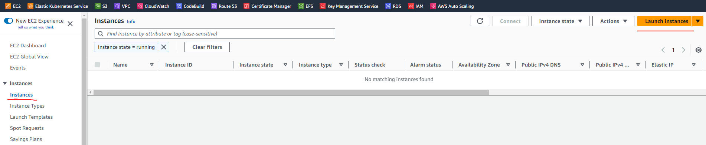
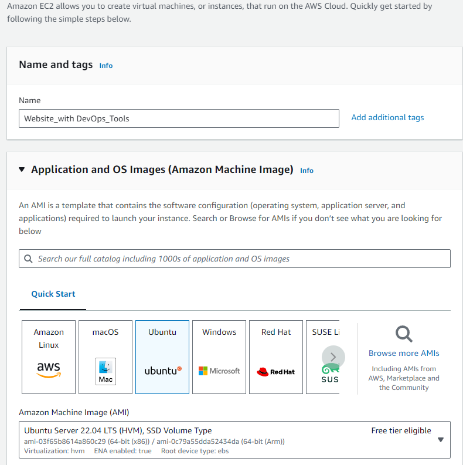
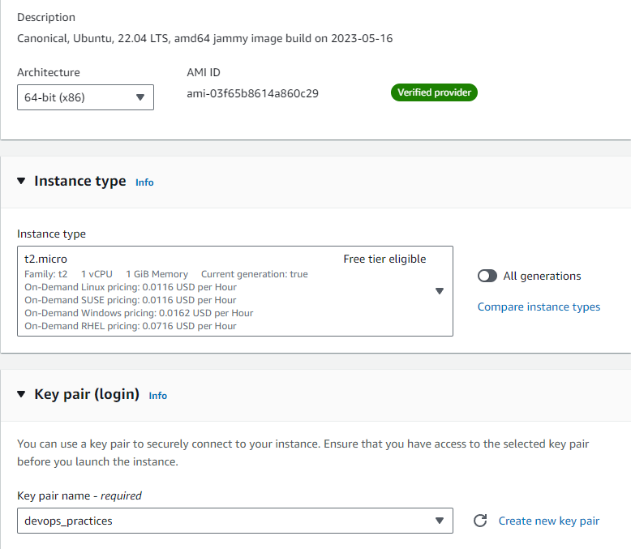
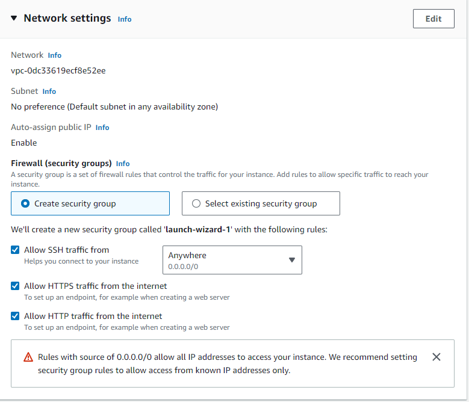
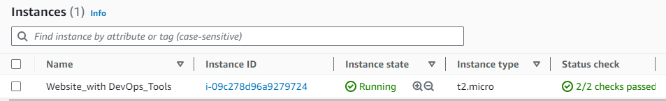
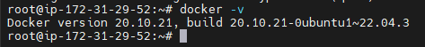
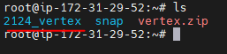
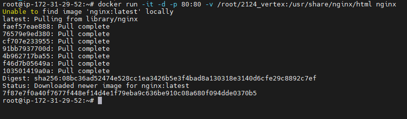
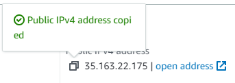
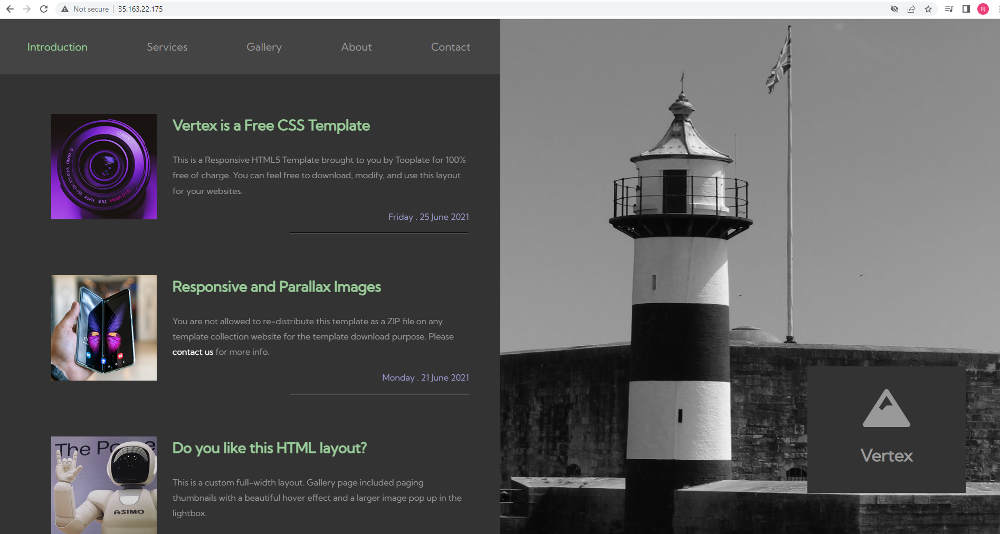

# Creating a website with DevOps Tools
#
## Steps
### 1. Go to any cloud provider GPC/AWS/Azure etc (for this case will use AWS)
#
### 2. Create a Virtual machine





#
### 3. Install Docker
```
sudo -i

apt-get update

apt install docker.io

docker -v
```

#
### 4. Download website
### Download website from [https://www.free-css.com/]
```
wget [https://www.free-css.com/assets/files/free-css-templates/download/page293/vertex.zip]

apt install unzip

unzip vertex.zip
```

#
### 5. Webserver is required, we can use Apache, Tomcat, Nginx, etc. For this time will run a nginx container with downloaded website
```
docker run -it -d -p 80:80 -v /root/2124_vertex:/usr/share/nginx/html nginx
```
### Docker container will be running on the port 80 (-p 80:80) on interactive mode (-it)
### Run the html code from /root/21424_vertex and connect into the /usr/share/nginx/html location available in the nginx container
#
### Go to IPaddress_80 and verify
#

#

### paste it in a browser and you will see the vertex website up and running



