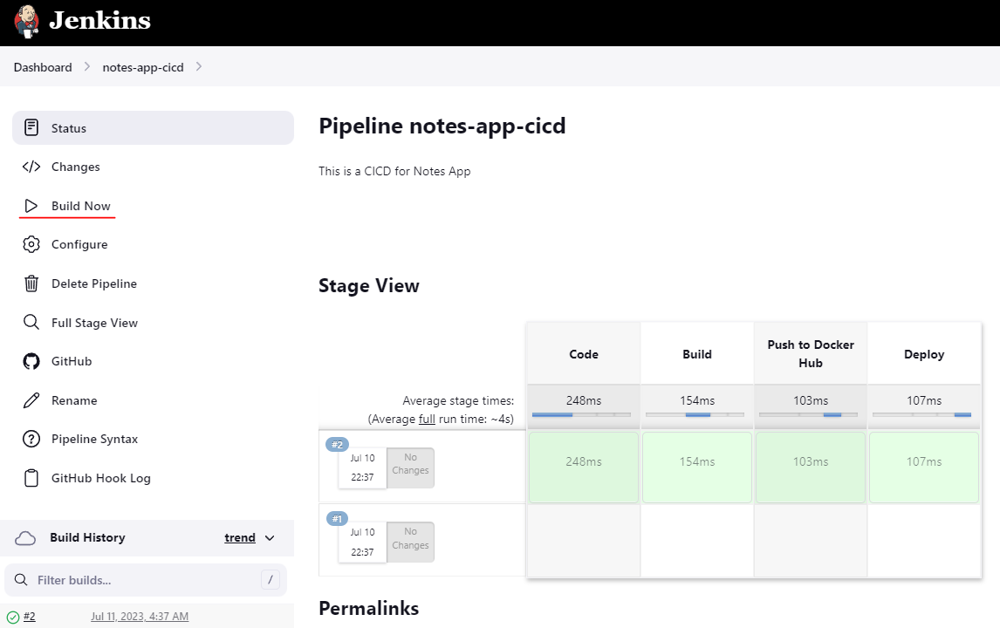
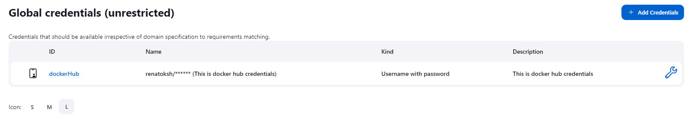

# 1_handson_devops
# Diagram
#

## Get Started
## 1.  Create and configure GitHub Repository

#
## 2. Create and Connect EC2 in AWS
#
## 3. Clone the repository from GitHub repository
### git clone https://github.com/Renatoksh/django-notes-app.git

#
## 4. Install Docker on the EC2 just created
```
sudo apt-get update
```
```
sudo apt install docker.io -y
```

#

#

#
## 5. Create container
```
docker build -t notes-app .
```
## 6. Install Jenkins
```
sudo apt update
sudo apt install openjdk-17-jre
```
#
```
curl -fsSL https://pkg.jenkins.io/debian/jenkins.io-2023.key | sudo tee \
  /usr/share/keyrings/jenkins-keyring.asc > /dev/null
echo deb [signed-by=/usr/share/keyrings/jenkins-keyring.asc] \
  https://pkg.jenkins.io/debian binary/ | sudo tee \
  /etc/apt/sources.list.d/jenkins.list > /dev/null
sudo apt-get update
sudo apt-get install jenkins
```
#

#

#

#

#

#

#

#

#
```
pipeline {
    agent any
    
    stages{
        stage("Code"){
            steps{
                echo "Clonning the code"
            }
        }
        stage("Build"){
            steps{
                echo "Building the code"
            }
        }
        stage("Push to Docker Hub"){
            steps{
                echo "Pushing the image to Docker Hub"
            }
        }
        stage("Deploy"){
            steps{
                echo "Deploying the container"
            }
        }
    }
}
```
#

#
```
sudo usermod -aG docker jenkins
sudo reboot
```
#

#

#

#

#

#
```
pipeline {
    agent any
    
    stages{
        stage("Code"){
            steps{
                echo "Clonning the code"
                git url:"https://github.com/Renatoksh/django-notes-app.git", branch: "main"
            }
        }
        stage("Build"){
            steps{
                echo "Building the code"
                sh "docker build -t notes-app ."
            }
        }
        stage("Push to Docker Hub"){
            steps{
                echo "Pushing the image to Docker Hub"
                withCredentials([usernamePassword(credentialsId:"dockerHub",passwordVariable:"dockerHubPass",usernameVariable:"dockerHubUser")]){
                sh "docker login -u ${env.dockerHubUser} -p ${env.dockerHubPass}"
                }
            }
        }
        stage("Deploy"){
            steps{
                echo "Deploying the container"
            }
        }
    }
}
```
#
### Build the job again to validate credentials work:

#
```
pipeline {
    agent any
    
    stages{
        stage("Code"){
            steps{
                echo "Clonning the code"
                git url:"https://github.com/Renatoksh/django-notes-app.git", branch: "main"
            }
        }
        stage("Build"){
            steps{
                echo "Building the code"
                sh "docker build -t my-note-app ."
            }
        }
        stage("Push to Docker Hub"){
            steps{
                echo "Pushing the image to Docker Hub"
                withCredentials([usernamePassword(credentialsId:"dockerHub",passwordVariable:"dockerHubPass",usernameVariable:"dockerHubUser")]){
                sh "docker tag my-note-app ${env.dockerHubUser}/my-note-app:latest"
                sh "docker login -u ${env.dockerHubUser} -p ${env.dockerHubPass}"
                sh "docker push ${env.dockerHubUser}/my-note-app:latest"
                }
            }
        }
        stage("Deploy"){
            steps{
                echo "Deploying the container"
            }
        }
    }
}
```
#

#

#

#
```
pipeline {
    agent any
    
    stages{
        stage("Code"){
            steps{
                echo "Clonning the code"
                git url:"https://github.com/Renatoksh/django-notes-app.git", branch: "main"
            }
        }
        stage("Build"){
            steps{
                echo "Building the code"
                sh "docker build -t my-note-app ."
            }
        }
        stage("Push to Docker Hub"){
            steps{
                echo "Pushing the image to Docker Hub"
                withCredentials([usernamePassword(credentialsId:"dockerHub",passwordVariable:"dockerHubPass",usernameVariable:"dockerHubUser")]){
                sh "docker tag my-note-app ${env.dockerHubUser}/my-note-app:latest"
                sh "docker login -u ${env.dockerHubUser} -p ${env.dockerHubPass}"
                sh "docker push ${env.dockerHubUser}/my-note-app:latest"
                }
            }
        }
        stage("Deploy"){
            steps{
                echo "Deploying the container"
                sh "docker run -d -p 8000:8000 renatoksh/my-note-app:latest"
            }
        }
    }
}
```
#

#

#
### Run again the build?

#
### To fix the issue, we need to install DockerCompose
#
```
sudo apt-get install docker-compose
```
#
### Cancel the installation of Docker-compose in case gets stuck, and try it again

#
### enter to the django-notes-app folder
```
cd django-notes-app
```
#
```
docker-compose up -d
```
### In case any error starting the docker-compose application, kill the process and try it again

#

#
### Resolution:
```
pipeline {
    agent any
    
    stages{
        stage("Code"){
            steps{
                echo "Clonning the code"
                git url:"https://github.com/Renatoksh/django-notes-app.git", branch: "main"
            }
        }
        stage("Build"){
            steps{
                echo "Building the code"
                sh "docker build -t my-note-app ."
            }
        }
        stage("Push to Docker Hub"){
            steps{
                echo "Pushing the image to Docker Hub"
                withCredentials([usernamePassword(credentialsId:"dockerHub",passwordVariable:"dockerHubPass",usernameVariable:"dockerHubUser")]){
                sh "docker tag my-note-app ${env.dockerHubUser}/my-note-app:latest"
                sh "docker login -u ${env.dockerHubUser} -p ${env.dockerHubPass}"
                sh "docker push ${env.dockerHubUser}/my-note-app:latest"
                }
            }
        }
        stage("Deploy"){
            steps{
                echo "Deploying the container"
                sh "docker-compose down && docker-compose up -d"
            }
        }
    }
}
```
#
### docker-compose.yml updated and commited

#
### Confidure Declarative Checkout SCM in Jenkins job

#
### Declarative Checkout SCM running and working

#
### Configure Webhook for Continuos Deployment
#
### Go to your Github repository django-notes-app
### Settings, Webhooks

#


#


https://github.com/Renatoksh/1_handson_devops/assets/95065208/14ce5771-d820-420b-8ae2-eacc276fc2e4
