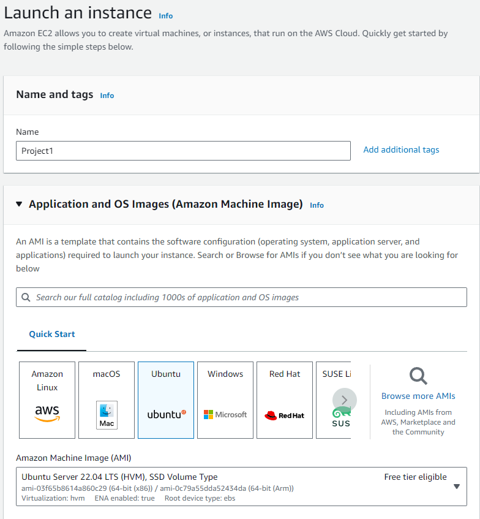
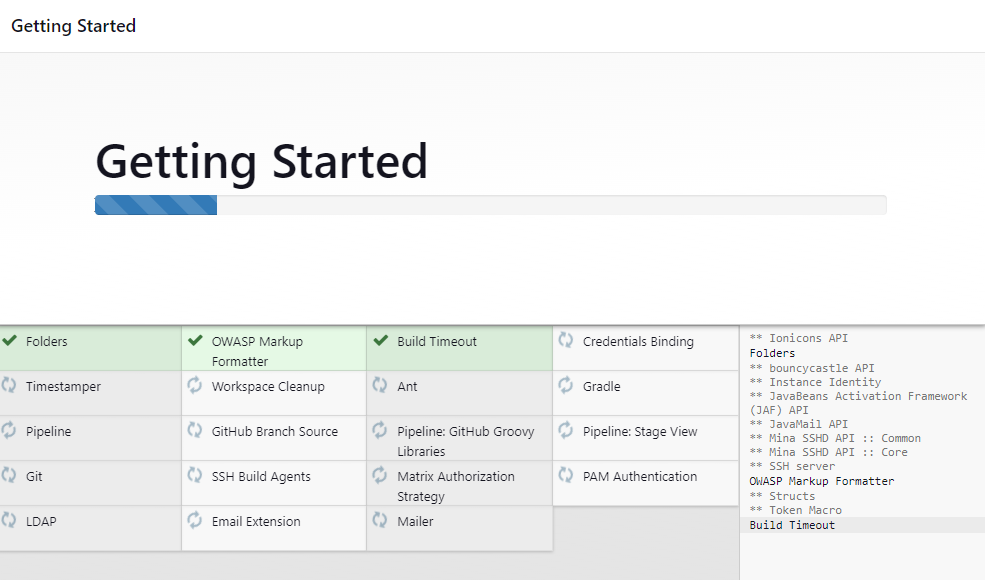
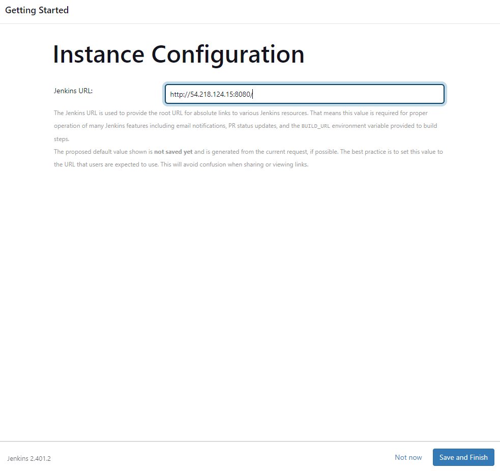
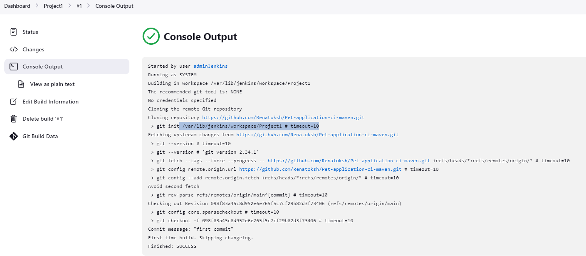
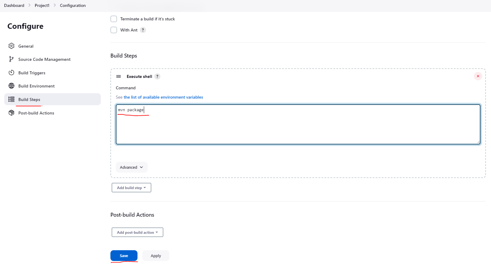

#
# Project 1
## Java project Springboot appwith Maven and CICD with Jenkins

#

#


#
### Step 1. Install Java
#### Java i a high-level, class-based, object-oriented programming language. It is a general-purpose programming language mean compiled Java code can run on all platforms that support Java
```
sudo apt update && sudo apt-get install openjdk-11-jdk-headless -y
```
## Step 2 . Add Jenkins Repository
### Reference
https://www.jenkins.io/doc/book/installing/linux/#debianubuntu
### Start by importing the GPG key. The GPG key verifies package integrity but there is no output. Run:
```
curl -fsSL https://pkg.jenkins.io/debian-stable/jenkins.io.key | sudo tee /usr/share/keyrings/jenkins-keyring.asc > /dev/null
```
#
### Add the Jenkins software repository to the source list and provide the authentication key:
```
echo deb [signed-by=/usr/share/keyrings/jenkins-keyring.asc] https://pkg.jenkins.io/debian-stable binary/ | sudo tee /etc/apt/sources.list.d/jenkins.list > /dev/null
```
#

#
## Step 3. Install Jenkins
### Run:
```
sudo apt update && sudo apt install jenkins -y
```
#
### Step 4. Verify Jenkins service
```
sudo systemctl status jenkins
```


#
### Step 5. Unlock Jenkins
```
sudo cat /var/lib/jenkins/secrets/initialAdminPassword
```









#
### Step 6. Insall SpringBoot
#### Spring Boot helps developers create applications that just run


#
### Step . Install Maven
#### Maven is a build automation tool user primarily for Java projects. Maven
#### can also be used and manage projects written in C#, Ruby, Scala, and other languages

```
apt install maven
```
### Build Now the job 

#
### Verify it is working

### cd target
### Add security group for port 8082

```
java -jar spring-petclinic-2.3.1.BUILD-SNAPSHOT.jar --server.port=8082
```


